# 派拉API平台操作手册-LLM篇

**上海派拉软件股份有限公司**

**2026-05**

---

# 1. 简介

## 1.1 LLM网关概述

派拉 API 平台在 6.6.1 版本新增 LLM 网关（AI Gateway）核心模块，为企业提供大模型服务的统一接入、智能路由调度、安全护栏和成本管控能力，帮助企业在 AI 时代构建统一、安全、可控的大模型服务平台。

LLM 网关支持 OpenAI、DeepSeek、Llama、OpenRouter、Qwen（通义千问）、Volcengine（火山引擎）等主流大模型提供商的统一代理接入，对外提供兼容 OpenAI API 协议的标准化调用接口，实现多模型统一管理和集中管控。

## 1.2 LLM功能介绍

本平台围绕 LLM 服务提供以下核心功能：

- **厂商管理：** 添加和管理大模型提供商，配置厂商类型、名称、API Key，支持模型启用/关停管控，支持配置厂商级别的 Guardrail 和配额。
- **路由策略：** 提供四种路由模式满足不同业务场景——Single（单一指定模型直连）、Fallback（主备故障转移）、Load Balance（按权重负载均衡）、Conditional（基于规则条件路由）。
- **AI安全护栏（Guardrail）：** 提供两层安全检查机制。确定性检查层支持正则匹配、Token 限制等规则；LLM 检查层支持内容过滤、PII 检测与自动脱敏、提示词注入攻击检测（Prompt Injection）、话题限制和语言过滤，保障 AI 服务的安全合规运行。支持全局和厂商两个维度配置。
- **配额管控：** 支持按厂商和消费方双维度配置请求次数与 Token 用量上限（每日/每周/每月），实现精细化成本管控。
- **消费方路由策略授权：** 在消费方管理中为消费方授权 LLM 路由策略，授权后消费方获取统一的 LLM 访问地址。
- **LLM日志：** 查看 LLM 网关的调用记录与运行日志，便于问题排查与调用分析。

## 1.3 术语定义

| 术语和缩写 | 解释 |
|---|---|
| LLM Gateway（AI 网关） | 大模型统一管控网关，提供多模型代理接入、智能路由、安全护栏、配额管控能力 |
| 厂商（Provider） | 大模型服务提供商，如 DeepSeek、OpenRouter、Qwen 等 |
| 路由策略（Routing Strategy） | 控制请求如何分发到不同厂商和模型的规则配置 |
| Single（单一路由） | 指定单一厂商和模型，所有请求直连转发 |
| Fallback（主备切换） | 配置主备两个厂商，主厂商异常时自动切换到备厂商 |
| Load Balance（负载均衡） | 多个厂商按权重比例分配流量 |
| Conditional（条件路由） | 根据请求体中 model 字段的值匹配条件规则，路由到对应厂商 |
| Guardrail（AI 安全护栏） | 对 LLM 请求和响应进行安全检查的规则集，支持全局和厂商两个维度配置 |
| 配额（Quota） | 对请求次数和 Token 用量的限制配置，防止过度消耗 |

---

# 2. LLM管理操作指南

## 2.1 登录与权限说明

**登录操作：**

- 访问平台登录页面，输入用户名和密码进行身份认证
- 认证通过后进入平台主界面

**权限要求：**

LLM管理菜单仅对具有相应权限角色的用户可见。若您无法看到LLM管理入口，请联系系统管理员为您分配LLM管理相关权限的用户角色。

> **提示：** 具备LLM管理权限角色的用户，方可进行厂商管理、路由策略配置、Guardrail配置、配额管控等操作。

## 2.2 厂商管理

### 2.2.1 添加厂商

**适用场景：** 您需要将一个新的大模型提供商接入平台，统一管理其 API Key 和模型配置。

**前置条件：** 已获取大模型提供商的 API Key（如 DeepSeek、OpenRouter 等）。

**操作步骤：**

1. 进入【LLM 管理】页面，点击【厂商管理】Tab
2. 点击"添加厂商"按钮
3. 配置厂商信息：厂商类型（如 DeepSeek）、厂商名称、API Key
4. 点击"确定"
5. 预期：提示"创建成功"，厂商卡片出现在列表中

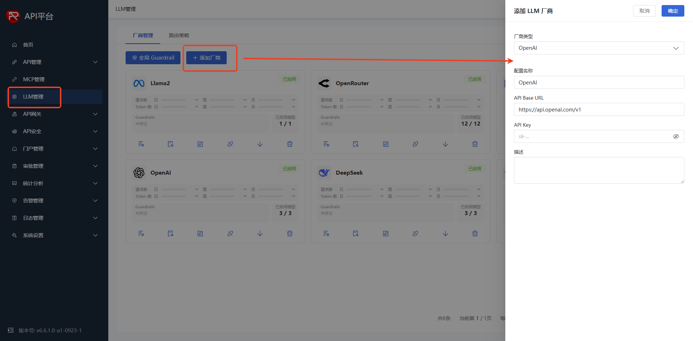

*图：添加LLM厂商*

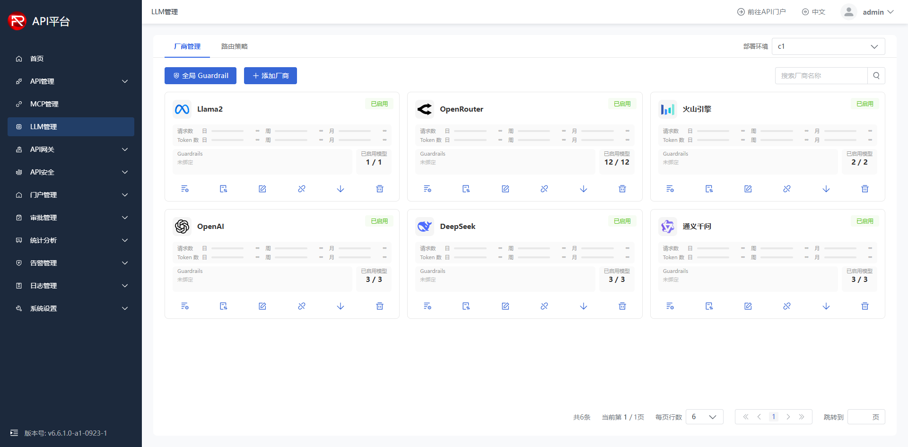

*图：厂商列表*

### 2.2.2 厂商卡片功能

厂商创建成功后，以卡片样式展示在厂商列表中。每张厂商卡片提供以下功能：

**卡片信息展示：**

- **配额使用率：** 卡片上直接显示当前厂商的请求数和 Token 数配额使用率，便于快速了解用量情况
- **Guardrails：** 显示该厂商是否已配置厂商级 Guardrail（针对此厂商的独立护栏规则）
- **已启用模型数：** 显示该厂商当前启用的模型数量

> **说明：** 厂商卡片上的 Guardrail 是针对该厂商自身的护栏配置；厂商列表顶部的"全局 Guardrail"按钮是管控当前环境下所有厂商的全局护栏配置。

**卡片操作：**

| 操作 | 说明 |
|---|---|
| 模型设置 | 管理厂商下的模型列表，支持：启用/禁用模型、删除模型、锁定模型、添加新模型 |
| 同步模型 | 自动从厂商同步最新的模型列表，无需手动逐个添加 |
| 编辑厂商 | 修改厂商配置信息（厂商类型、名称、API Key 等），配置项与创建时一致 |
| 停用 | 暂停该厂商的服务，停用后所有经过该厂商的请求将被拒绝 |
| 下线 | 选择要下线的具体模型进行下线操作 |
| 删除 | 永久删除此厂商及其所有配置，该操作不可逆 |

### 2.2.3 厂商配额配置

**适用场景：** 您需要对某个厂商的调用量进行限制，防止超出预算。

**操作步骤：**

1. 在【厂商管理】页面，点击厂商卡片上的请求数/Token 数区域，打开配额配置
2. 配置每日/每周/每月的请求次数和 Token 数上限（-1 表示不限制）
3. 点击"确定"
4. 预期：提示"配置成功"

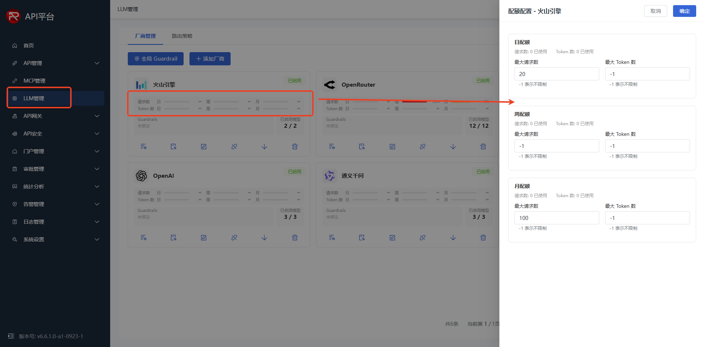

*图：厂商配额配置*

### 2.2.4 全局 Guardrail 配置

**适用场景：** 您需要为所有厂商统一配置 AI 安全护栏规则，保障大模型调用的安全合规。

**操作步骤：**

1. 在【厂商管理】页面，点击"全局 Guardrail"按钮
2. 根据业务需求配置以下护栏规则（均为可选配置）：

| 护栏类型 | 说明 |
|---|---|
| Content Filter（内容过滤） | 过滤涉及仇恨、暴力、色情等不当内容 |
| Prompt Injection（提示注入检测） | 检测并拦截提示词注入攻击 |
| PII Detection（个人信息脱敏） | 检测并脱敏手机号、身份证号、邮箱等敏感信息 |
| Token Limit（Token 限制） | 限制单次请求的最大输入/输出 Token 数 |
| Regex Match（正则匹配） | 自定义正则表达式拦截特定内容 |
| Topic Restriction（话题限制） | 屏蔽特定话题（如政治、宗教等） |
| Language Filter（语言过滤） | 仅允许指定语言的请求通过 |

3. 点击"确定"保存配置
4. 预期：提示"配置成功"

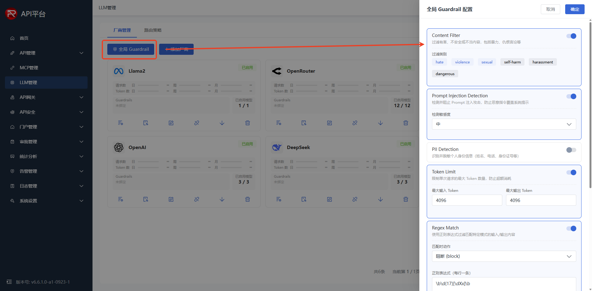

*图：全局护栏配置*

> **Guardrail 检测顺序：** 请求到达时，先经过全局 Guardrail 检测，全局检测通过后再匹配路由对应的具体厂商，执行该厂商配置的 Guardrail 检测。如果全局 Guardrail 拦截了请求，则直接返回拦截结果，不会继续到厂商级检测。

## 2.3 路由策略

### 2.3.1 添加路由策略

**适用场景：** 您需要创建路由规则，控制 LLM 请求如何分发到不同厂商和模型。

**前置条件：** 已完成至少一个厂商的添加。

**操作步骤：**

1. 进入【LLM 管理】页面，切换到"路由策略"Tab
2. 点击"添加策略"按钮
3. 配置策略名称、选择路由模式、配置路由目标
4. 点击"确定"
5. 预期：提示"创建成功"，策略列表中新增一条路由策略

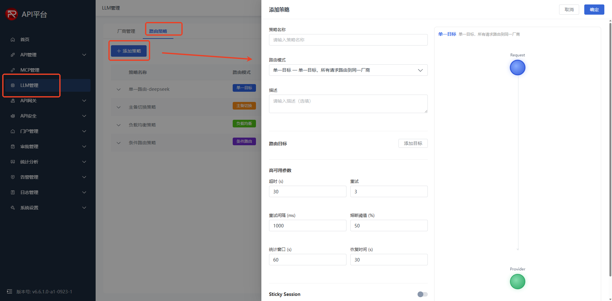

*图：创建路由策略*

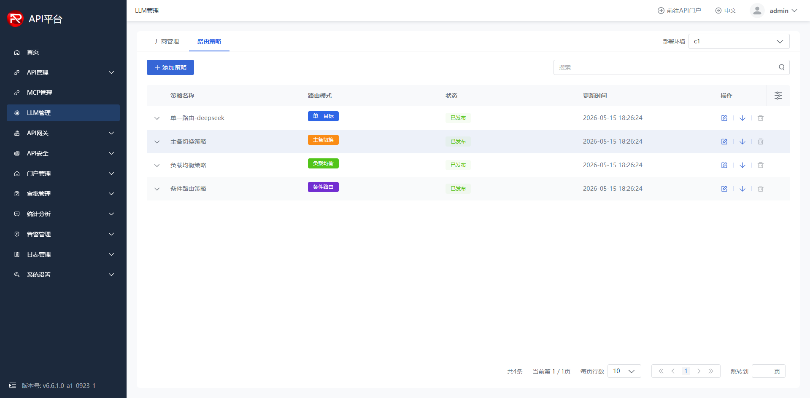

*图：路由策略列表*

### 2.3.2 四种路由模式详解

#### Single（单一路由）

指定单一厂商和模型，所有请求直连转发。适合固定使用某个模型的场景，配置最简单。

**配置要点：** 选择一个厂商和对应的模型作为唯一目标。不管请求体中 model 传什么值，所有请求都只转发到配置的唯一目标。

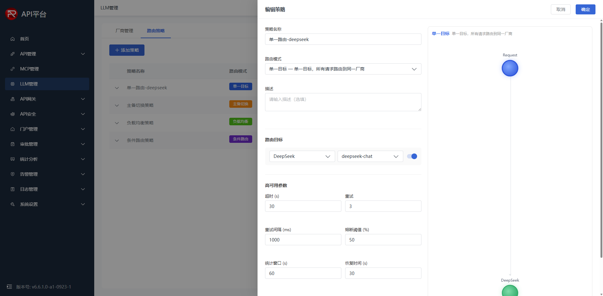

*图：单一路由策略配置*

#### Fallback（主备切换）

配置主备两个厂商，主厂商返回 429（限流）、500（内部错误）、503（不可用）时，自动切换到备厂商继续处理请求，保障服务可用性。

**配置要点：** 分别选择主厂商和备厂商及对应模型，配置触发切换的状态码。

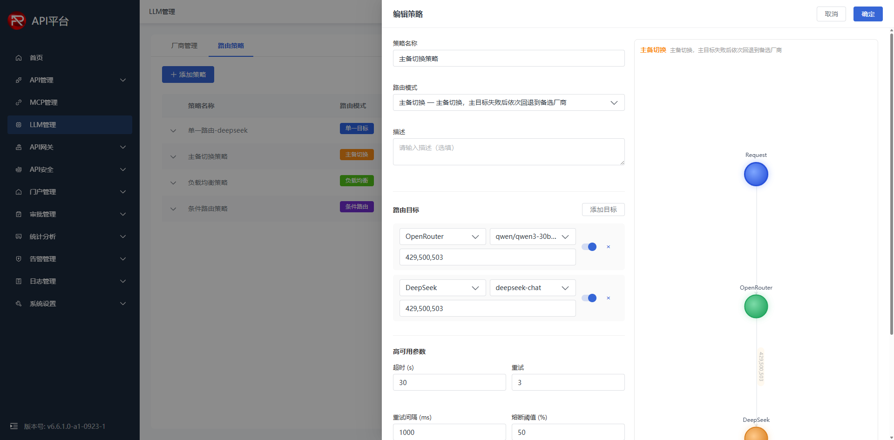

*图：主备切换策略配置*

#### Load Balance（负载均衡）

多个厂商按权重比例分配流量，分散请求压力，降低对单一厂商的依赖。权重越高，分配的请求比例越大。

**配置要点：** 添加多个厂商和模型，为每个目标配置权重百分比。

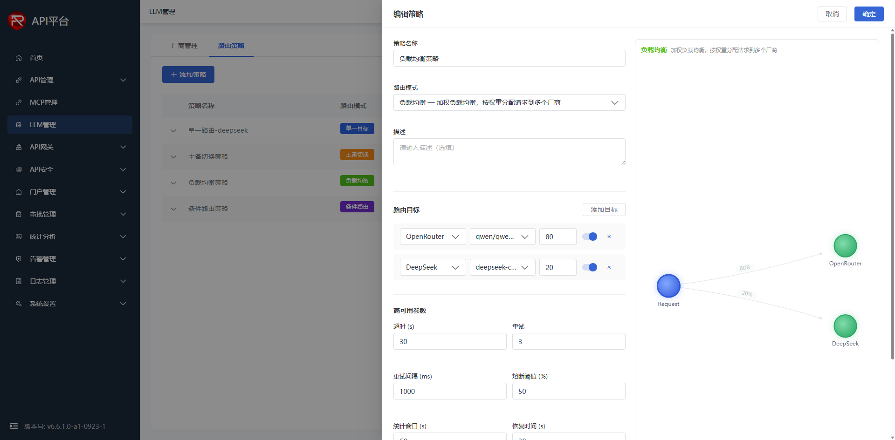

*图：负载均衡策略配置*

#### Conditional（条件路由）

根据请求体中 model 字段的值匹配条件规则，将请求路由到对应的厂商和模型。适合一个入口地址对接多个模型的场景。

**配置要点：** 添加多条匹配规则，每条规则定义 model 字段包含的关键词和对应的目标厂商/模型。

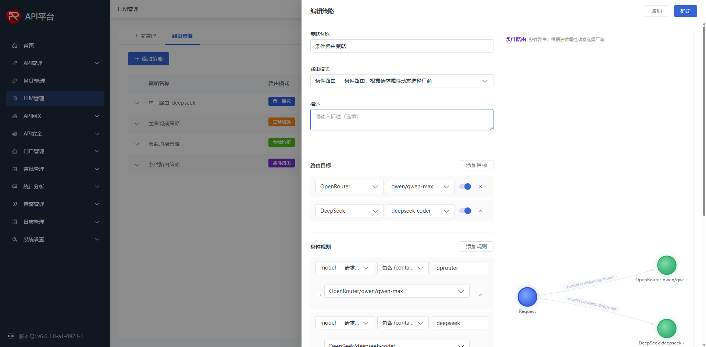

*图：条件路由策略配置*

## 2.4 消费方创建

**适用场景：** 如尚无可用消费方，需先创建消费方后才能进行路由策略授权。

**前置条件：** 具备消费方管理权限。

**操作步骤：**

1. 进入【门户管理】-【消费方管理】，点击"创建应用"
2. 填写应用名称、选择认证方式（如 Key-Auth）
3. 点击"确定"
4. 预期：创建成功，页面显示 AppId 和 ApiKey，记录备用

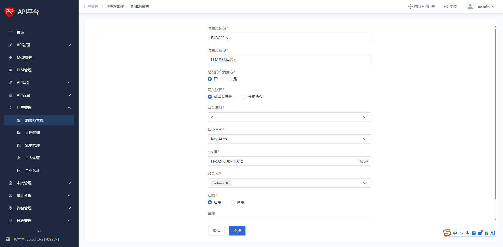

*图：创建消费方*

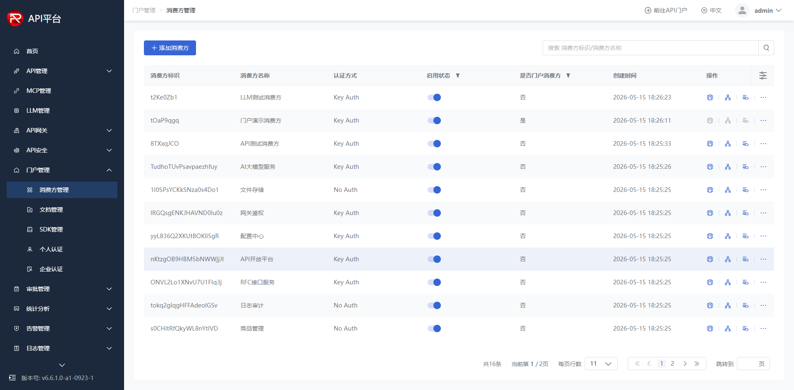

*图：消费方列表*

## 2.5 消费方路由策略授权

**适用场景：** 您需要为消费方授权 LLM 路由策略，使其获得大模型调用权限和统一的 LLM 访问地址。

**前置条件：** 已创建消费方，已创建并配置至少一条路由策略。

**操作步骤：**

1. 进入【门户管理】-【消费方管理】，在消费方列表中找到目标消费方
2. 点击操作列的"路由策略授权"按钮
3. 选择部署环境（如 c1）
4. 勾选要授权的路由策略，点击"确认授权"
5. 预期：提示"授权成功"
6. 复制页面中显示的 LLM 访问地址，后续调用时使用

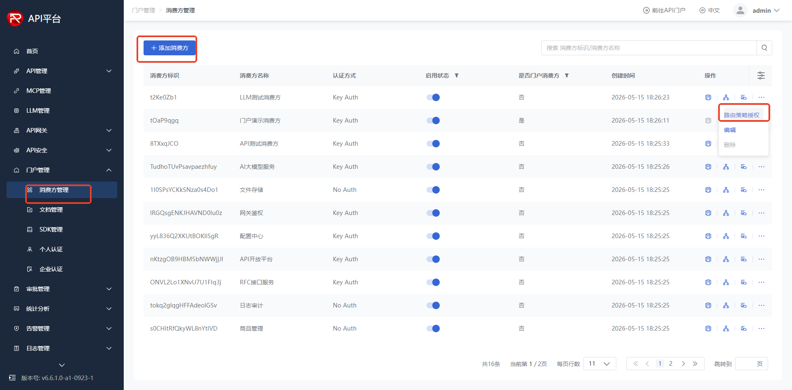

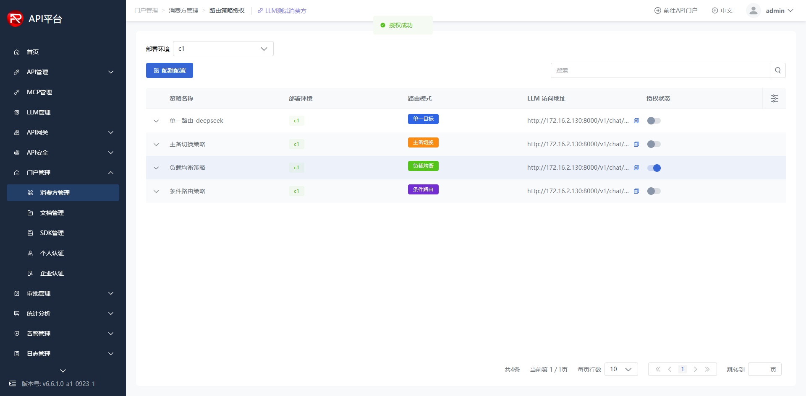

*图：路由策略授权*

**消费方维度配额配置：**

在【门户管理】-【消费方管理】中，点击操作列的"路由策略授权"按钮，切换到对应部署环境后，点击左上方的"配额配置"按钮，可为该消费方单独配置请求次数和 Token 数上限（每日/每周/每月），实现消费方级别的精细化成本管控。

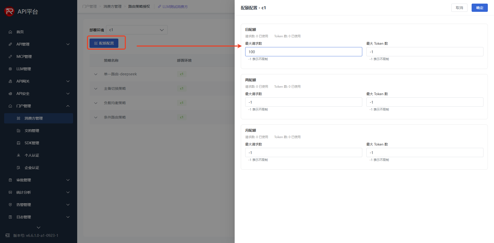

*图：消费方配额配置*

> **同步机制：** 消费方路由策略授权与消费方的 LLM 调用权限保持同步。授权后，消费方即可通过 LLM 访问地址调用大模型；取消授权后，调用权限同步收回。

## 2.6 LLM 调用验证

**适用场景：** 您已完成厂商添加、路由策略配置和消费方授权，需要验证 LLM 调用链路是否正常。

**前置条件：** 已完成消费方路由策略授权，已获取 LLM 访问地址和 ApiKey。

**操作步骤：**

使用授权后获取的 LLM 访问地址和 ApiKey，执行以下命令验证：

```bash
curl -X POST "http://<实际LLM访问地址>" \
  -H "Content-Type: application/json" \
  -H "apikey: <实际ApiKey>" \
  -d '{"model":"deepseek-chat","messages":[{"role":"user","content":"你好"}],"stream":false}'
```

预期：返回 HTTP 200，AI 模型正常回复。

> **提示：** LLM 网关对外提供兼容 OpenAI API 协议的标准化接口，消费方通过同一个访问地址即可调用不同厂商的模型，具体路由到哪个厂商取决于授权的路由策略配置。

## 2.7 LLM 日志

**适用场景：** 您需要查看 LLM 网关的调用记录，用于问题排查、调用分析或审计追踪。

**前置条件：** 已通过消费方授权的 LLM 访问地址成功调用过大模型。

**页面功能说明：**

具备 LLM 日志权限的用户，登录 API 管理平台后，点击左侧菜单栏的【日志管理】-【LLM日志】，可进入到 LLM 日志页面。LLM 日志页面支持多维度搜索和筛选，便于快速定位目标调用记录。

**日志信息展示：**

列表展示每条调用记录的详细信息：

| 字段 | 说明 |
|---|---|
| 提供方 | 服务提供方标识 |
| 消费方 | 发起调用的消费方应用 |
| 接口名称 | 调用的接口名称 |
| 流水号 | 本次调用的唯一流水号 |
| 服务耗时 | 请求到响应的总耗时 |
| 响应码 | HTTP 响应状态码 |
| 请求时间 | 调用发起的时间 |
| 部署环境 | 调用所属的部署环境 |
| 操作 | 查看详情、下载等操作 |

支持按消费方、日志类型、流水号、响应码、请求/响应包含内容、时间范围等多维度筛选，支持导出。

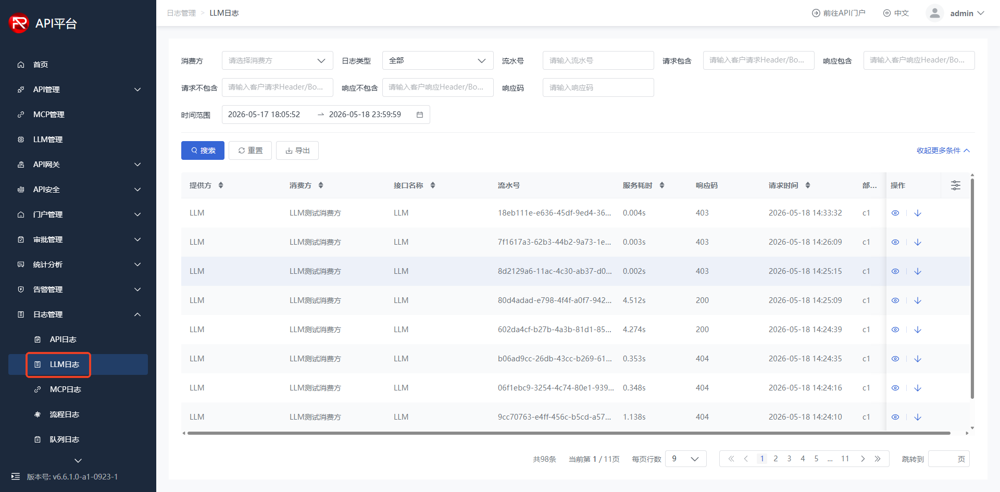

*图：LLM日志列表*

## 2.8 AI 计费

**适用场景：** 您需要查看 LLM 调用的 Token 消耗和费用明细，用于成本分析和费用核算。

**页面功能说明：**

登录 API 管理平台后，点击左侧菜单栏的【统计分析】-【AI计费】，可进入 AI 计费页面。页面支持按提供方、服务名称、消费方、模型供应商、模型等多维度搜索和筛选。

列表展示每条调用记录的计费详情，包括：提供方、服务名称、服务类型、消费方、消费方类型、模型供应商、模型、输入 Token、输出 Token、花费金额、请求时间、部署环境等。支持导出数据和查看 AI 计费统计汇总。

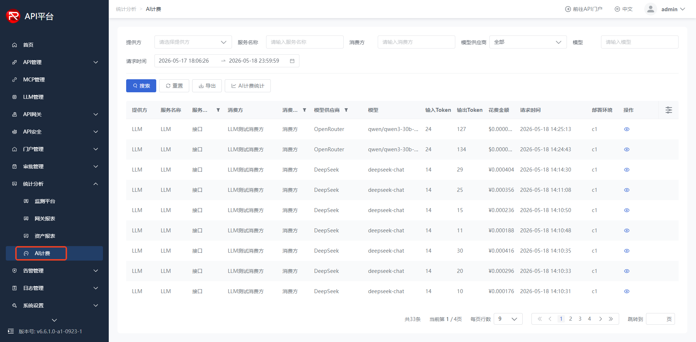

*图：统计分析-AI计费*

## 2.9 首页 Token 统计

**适用场景：** 管理员需要在首页快速了解各厂商的 Token 使用趋势。

**页面功能说明：**

登录 API 管理平台后，首页右侧展示 **Token 统计** 图表，按厂商维度（DeepSeek、OpenAI、QWen、LLAMA、OpenRouter、VolceEgine 等）展示 Token 使用量趋势，包括各厂商的输入 Token（in）和输出 Token（out）数据，便于快速掌握各厂商的调用量分布和变化趋势。

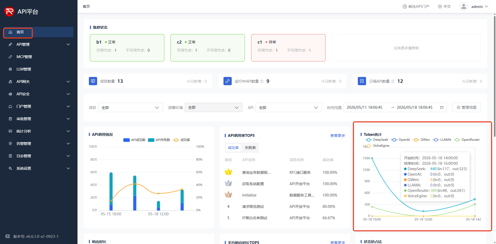

*图：首页-Token统计*
