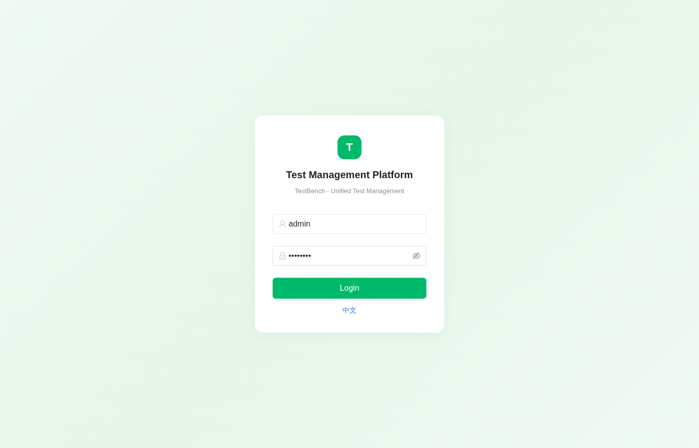
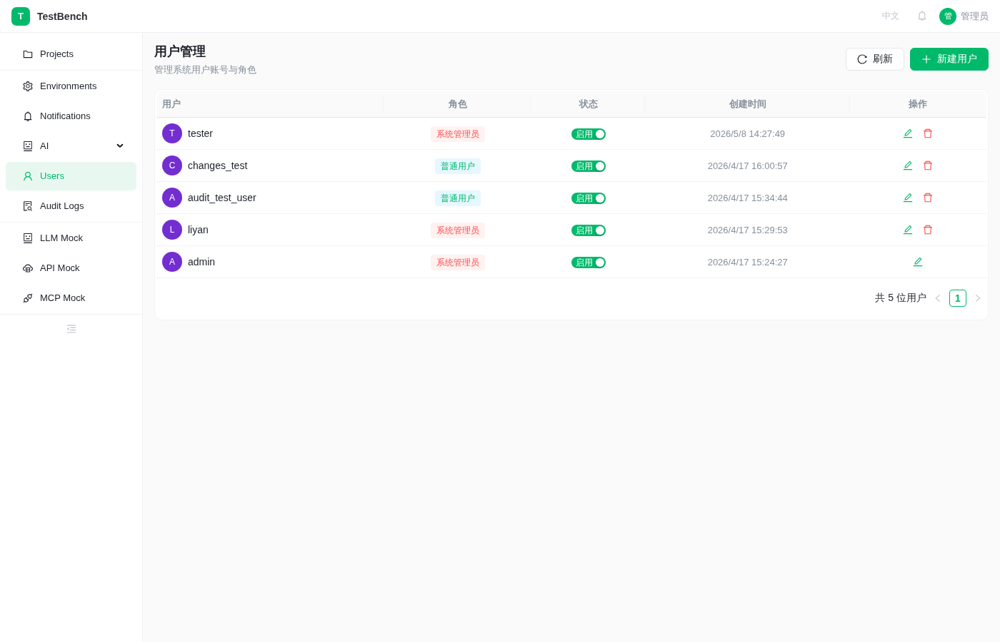
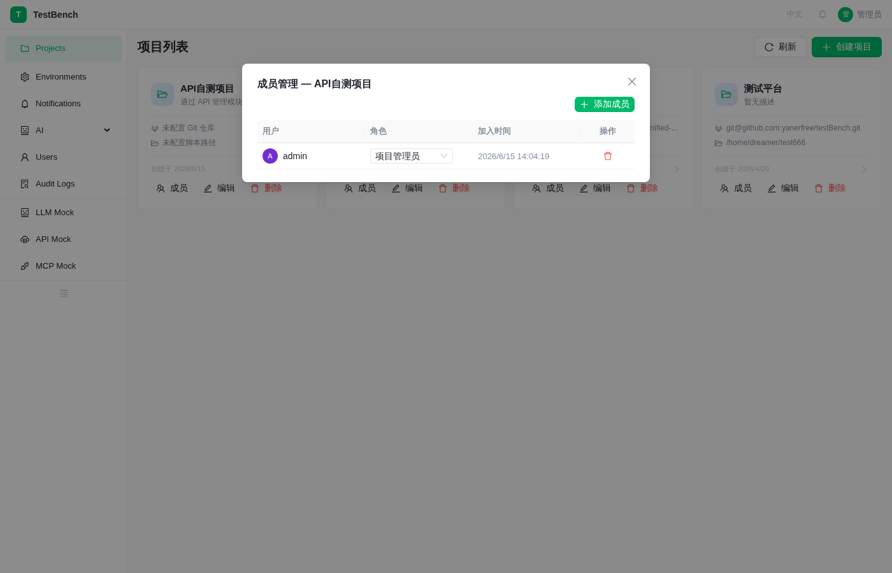
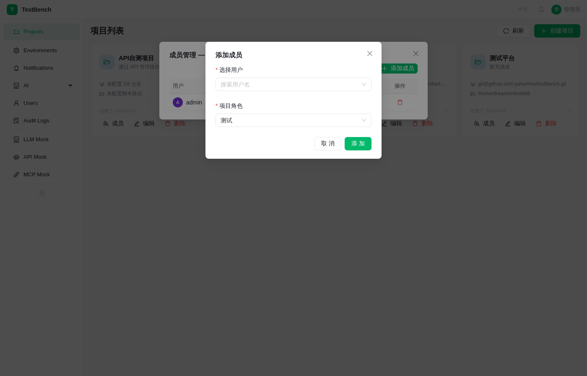
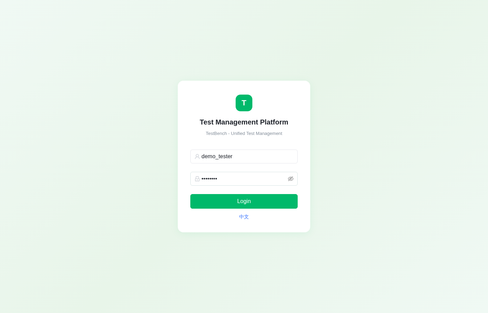

# User & Project Management — Create Users, Assign Projects, Create Test Cases

Demonstrates the complete user management and project permission workflow: Admin creates a regular user → assigns the user to a project → user logs in and enters the project → creates test cases.

Modules involved: User Management, Project Management (Members), Test Case Management

__Demo duration__: ~5 minutes

## Scenario Overview

The testBench test management platform supports multi-user, multi-project permission management. Administrators can create users and assign them to specific projects. Regular users can only see projects they've been assigned to after logging in, and can create and manage test cases within those projects.

This scenario demonstrates the complete workflow from creating a user to the user independently using the system.

## Prerequisites

Log in as System Administrator (admin / admin123)
At least one project must already exist

> **Note:** Usernames, project names, etc. in this document are example values. If you encounter a "name already exists" error, simply replace with any name that doesn't exist in the system.

## Steps

### Step 1: Administrator Login

1. Open the system URL, navigate to the login page
2. Enter admin credentials: admin / admin123
3. Click [Login]
	- Expected: "Login successful" message appears, redirected to project list

Administrator Login Page

### Step 2: Create a Regular User

1. Click [Users] in the left sidebar menu
2. Click the [Add User] button
3. Fill in user information:
   - Username: demo_tester
   - Password: Test1234
   - Role: user (regular user)
4. Click [OK]
	- Expected: "Created successfully" message, demo_tester appears in the user list

User Management List

### Step 3: Assign User to a Project

1. Return to the project list, find the target project (e.g., "API Test Project")
2. Click the [Members] button on the project card
3. In the member management dialog, click [Add Member]
4. Select user demo_tester, set role to tester
5. Click [OK]
	- Expected: "Added successfully" message, demo_tester appears in the member list

Project Member List

Add Project Member

### Step 4: Regular User Login

1. Log out of the admin account
2. Log in with demo_tester / Test1234
3. Click [Login]
	- Expected: Login successful, project list shows only assigned projects

Regular User Login

Regular User Project List

### Step 5: Enter Project and Create Test Case

1. Click the assigned project card to enter the project
2. Click [Test Cases] in the left sidebar menu
3. Click the [New Case] button in the toolbar
4. Fill in case information:
   - Title: User Registration - Normal Flow
   - Module: User Management
   - Priority: P1
   - Steps: Fill registration form → Click register → Verify success
5. Click [Save]
	- Expected: "Created successfully" message, new case appears in the case list

__Demo script__: Administrators centrally manage users and permissions. Regular users only see projects they're responsible for, independently manage test cases within projects. Clear permissions, secure operations.
