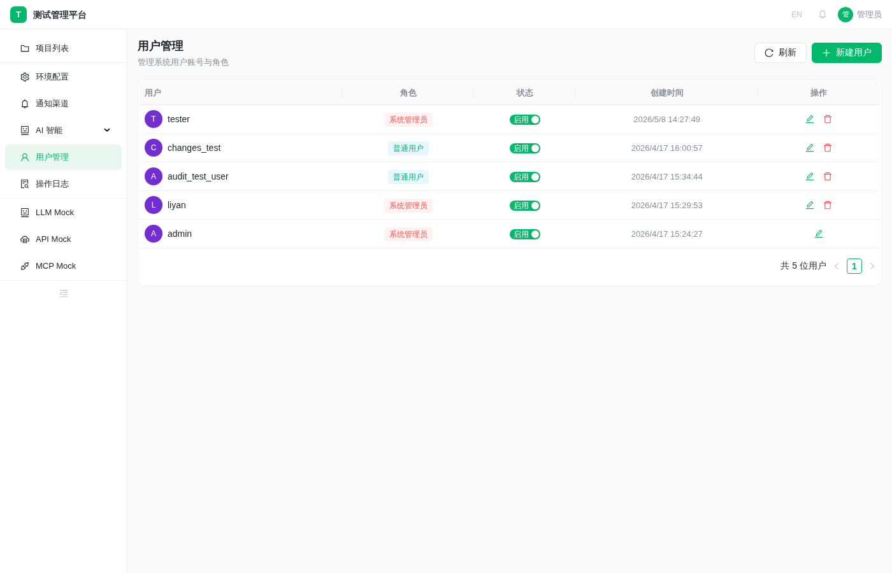
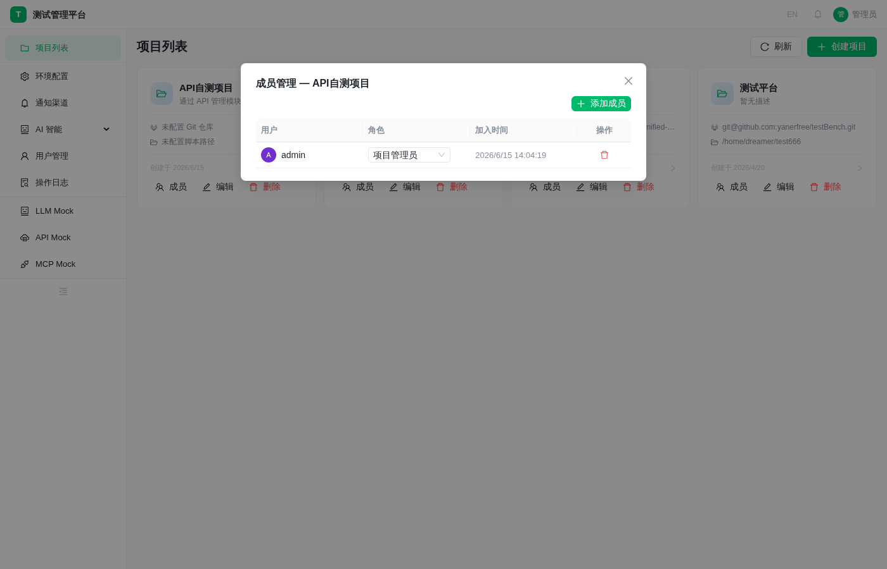
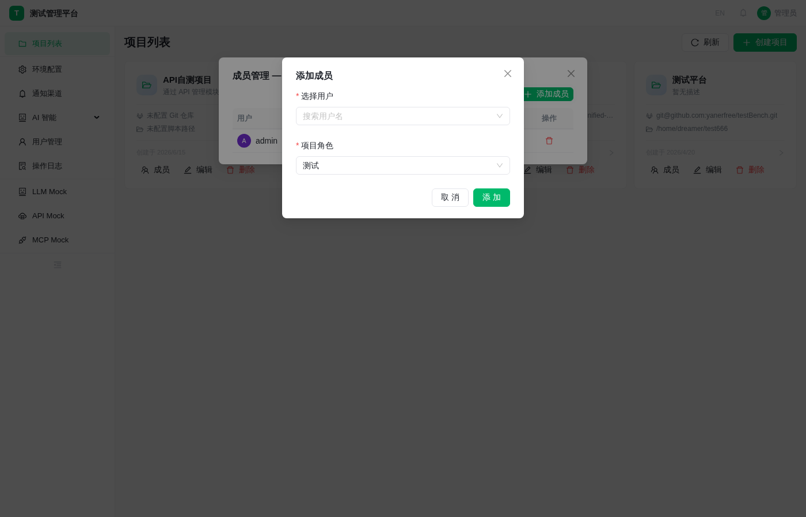
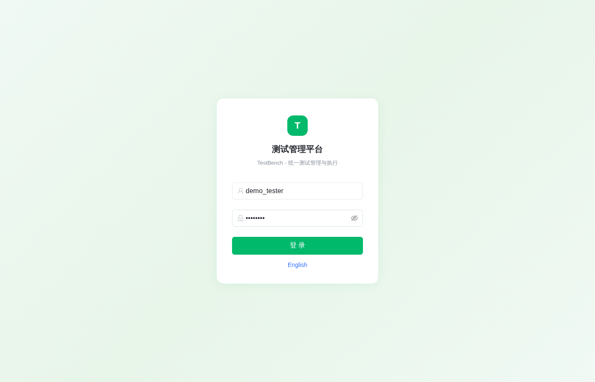
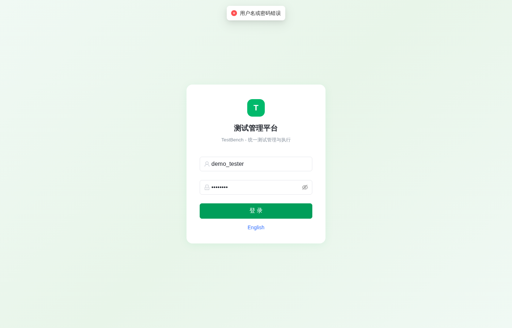

# 用户与项目管理 — 创建用户、分配项目、创建测试用例

演示用户管理与项目权限的完整工作流：管理员创建普通用户 → 将用户分配到项目 → 用户登录后进入项目 → 创建测试用例。

涉及模块：用户管理、项目管理（成员）、用例管理

__演示耗时__：约 5 分钟

## 场景概述

testBench 测试管理平台支持多用户、多项目的权限管理。管理员可以创建用户并分配到指定项目，普通用户登录后只能看到自己被分配的项目，在项目内可以创建和管理测试用例。

本场景演示从创建用户到用户独立使用系统的完整链路。

## 前置条件

使用系统管理员角色登录（admin / admin123）
至少有一个已创建的项目

> **操作提示：** 文档中的用户名、项目名称等均为示例值。如遇"名称已存在"提示，请替换为任意不存在的名称即可。

## 操作步骤

### 步骤一：管理员登录

1. 打开系统地址，进入登录页面
2. 输入管理员账号：admin，密码：admin123
3. 点击【登录】
	- 预期：提示「登录成功」，进入项目列表页面

管理员登录页面

### 步骤二：创建普通用户

1. 点击左侧菜单【用户管理】
2. 点击【新增用户】按钮
3. 填写用户信息：
   - 用户名：demo_tester
   - 密码：Test1234
   - 角色：user（普通用户）
4. 点击【确定】
	- 预期：提示「创建成功」，用户列表中出现 demo_tester

用户管理列表

### 步骤三：将用户分配到项目

1. 返回项目列表，找到目标项目（如"API自测项目"）
2. 点击项目卡片上的【成员】按钮
3. 在成员管理弹窗中点击【添加成员】
4. 选择用户 demo_tester，角色选择 tester
5. 点击【确定】
	- 预期：提示「添加成功」，成员列表中出现 demo_tester

项目成员列表

添加项目成员

### 步骤四：普通用户登录

1. 退出管理员账号
2. 使用 demo_tester / Test1234 登录
3. 点击【登录】
	- 预期：登录成功，项目列表中仅显示被分配的项目

普通用户登录

普通用户项目列表

### 步骤五：进入项目并创建用例

1. 点击被分配的项目卡片，进入项目
2. 左侧菜单点击【用例管理】
3. 点击工具栏【新建用例】按钮
4. 填写用例信息：
   - 标题：用户注册-正常流程
   - 模块：用户管理
   - 优先级：P1
   - 步骤：填写注册信息 → 点击注册 → 验证注册成功
5. 点击【保存】
	- 预期：提示「创建成功」，用例列表中出现新用例

__演示话术__：管理员集中管控用户和权限，普通用户只看到自己负责的项目，在项目内独立管理测试用例，权限清晰、操作安全。
